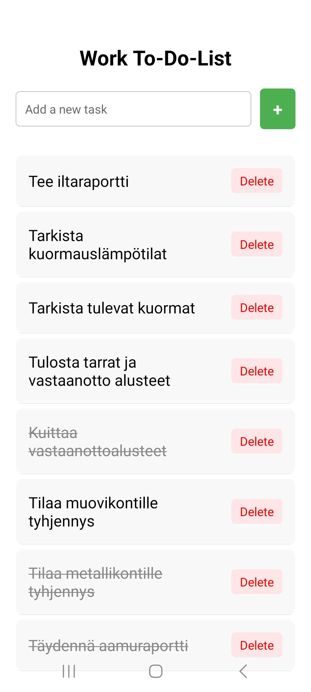
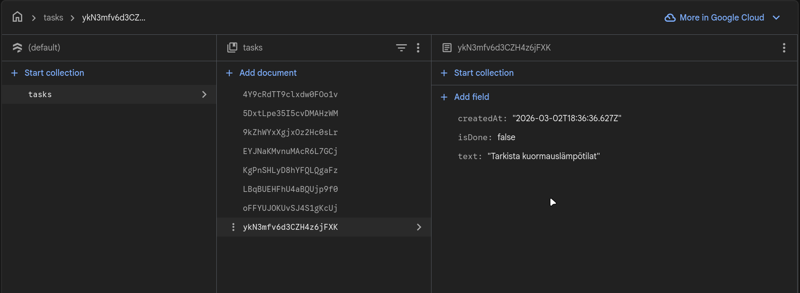

## Week8 - Firebase - To-Do-App

The idea of this task was to practice usage of Firebase/Firestore. I have been thinking of this as a diary-style app for managers at work, so we could just check from the app which tasks are done for the day. This application is a basic To-Do-App which we have created before and would work as a great frame for the diary app. It uses Google Firebase for the database and backend logic.

All the logic is in App.tsx and the /Firebase/Config.js contains all the API information for the Firebase. I have provided Config.example.js file as an example of the real Config.js file.

## How it works

All the data is stored in a Firestore collection called "tasks".

onSnapshot listens for real time changes (addTask, toggleTaskDone or deleteTask) and the UI updates automatically.

The App has basic functions:

1. addTask -> Adds a task into Firestore and displays it on screen

2. toggleTaskDone -> Is activated when task is pressed on the screen. Draws a line over the task name and flips boolean isDone value between false and true

3. deleteTask -> Deletes a task.

## Future improvements

Since the app is very simple, all the logic is in App.tsx. In future for larger project and applications the file and project structure should be broken down into smaller pieces.
